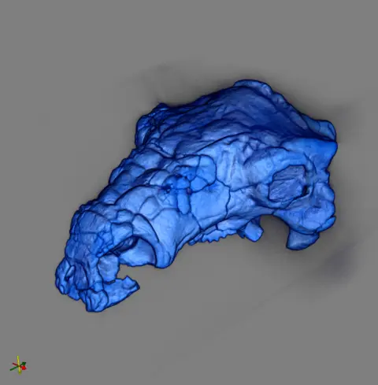

# OME-Zarr Open SciVis Datasets


> The OME-Zarr Open SciVis Datasets project provides the Open SciVis Dataset in a chunked, multi-scale format, encodes metadata in JSON according to the OME-Zarr specification, and hosts the datasets on AWS S3 through the AWS Open Data Program, aiming to serve as a web-based resource for the scientific visualization community to enhance reproducibility and facilitate testing and development of OME-Zarr tools.

## Introduction

### OME-Zarr

[OME-Zarr](https://ngff.openmicroscopy.org/) is a cloud-optimized bioimaging
file format that has emerged as a promising solution to address the challenges
of scalability and heterogeneity in scientific data exchange. Developed by the
Open Microscopy Environment (OME) in collaboration with an international
community of researchers and institutions, OME-Zarr builds upon the Zarr format
to provide a flexible and scalable method for storing multidimensional imaging
data and associated metadata.

The format is designed to support both pixel measurements and relevant imaging
metadata, including experimental, acquisition, and analytic information.
OME-Zarr offers significant advantages over traditional formats like TIFF and
HDF5, particularly in its ability to efficiently handle large, multi-Gigabyte to
Petabyte datasets in cloud-based storage environments. By storing data in
individually referenceable "chunk" files, OME-Zarr enables fast, random access
to specific portions of large datasets without requiring access to the entire
file.

Since its initial publication in 2021, OME-Zarr has seen rapid adoption and
expansion of supporting tools. The format now accommodates a wide range of
bioimaging modalities and derived data types, such as regions of interest (ROIs)
and segmentation labels. This growth has been driven by an open, collaborative
development process that brings together diverse use cases and requirements from
across the bioimaging community. As a result, OME-Zarr is emerging as a unifying
format that promotes FAIR (Findable, Accessible, Interoperable, and Reusable)
data principles in the bioimaging domain, facilitating more efficient data
management, analysis, and sharing across personal, institutional, and global
scales.

For more information about OME-Zarr, including the latest specifications,
reference implementations, and community resources, please visit the [OME-Zarr
website](https://ngff.openmicroscopy.org/), including the [reference
publications](https://ngff.openmicroscopy.org/publications/index.html) and the
[format
specification](https://ngff.openmicroscopy.org/specifications/index.html).

### Open SciVis Datasets

The [Open SciVis Datasets](https://klacansky.com/open-scivis-datasets/), curated
by Pavol Klacansky, is a valuable resource for the scientific visualization
community. This collection provides a diverse range of volumetric datasets that
are freely available for use in research, education, and development of
visualization techniques.

The datasets span various scientific domains, including medical imaging, fluid
dynamics, astrophysics, and materials science. Each dataset is provided in a
standardized format, typically raw binary files accompanied by metadata
describing dimensions, data types, and other relevant information.

One of the key benefits of this collection is that it offers high-quality,
real-world datasets that can be used to test and benchmark visualization
algorithms and software. This is particularly useful for researchers and
developers working on volume rendering, isosurface extraction, transfer function
design, and other visualization techniques.

The Open SciVis Datasets website provides easy access to download the datasets,
along with previews and descriptions of each dataset's contents and origins.
This makes it simple for users to find appropriate datasets for their specific
needs or interests.

By making these datasets freely available, Klacansky's collection promotes
reproducibility in scientific visualization research and enables fair
comparisons between different visualization methods using common benchmark data.

### Project Overview

The OME-Zarr Open SciVis Datasets project is an innovative initiative that brings together two valuable resources for the scientific visualization community: the Open SciVis Datasets curated by Pavol Klacansky and the OME-Zarr file format developed by the Open Microscopy Environment.

This project takes the original Open SciVis Datasets and converts them into the OME-Zarr format, providing several key enhancements:

1. The datasets are restructured into a chunked, multi-scale form, allowing for efficient access to different resolutions and subsets of the data.

2. Metadata for each dataset is encoded in JSON format according to the OME-Zarr specification, providing standardized and machine-readable information about the data's structure and properties.

3. The converted datasets are hosted on Amazon Web Services (AWS) S3 through the AWS Open Data Program, ensuring wide accessibility and scalability.

The primary aim of the OME-Zarr Open SciVis Datasets project is to create a web-based resource that serves the scientific visualization community in multiple ways:

- It promotes reproducibility in research by providing standardized, easily accessible datasets that can be used as benchmarks or test cases across different studies.

- It offers a rich dataset resource for developers working on OME-Zarr tools, allowing them to test and refine their implementations using real-world scientific data.

- It demonstrates the capabilities of the OME-Zarr format in handling diverse types of scientific visualization data, from medical imaging to fluid dynamics simulations.

By combining the high-quality datasets from the Open SciVis collection with the advanced features of the OME-Zarr format, this project aims to accelerate progress in scientific visualization research and tool development while fostering greater interoperability and data sharing within the community.

## Datasets

### 3d_neurons_15_sept_2016


> The neurons are macaque visual cortical neurons labeled with TdTomato fluorescent proteins.

<details>
<summary>Details</summary>

**Dataset Name:** 3d_neurons_15_sept_2016

**Dataset Type:** uint16

**Dataset Size:** [2048, 2048, 1718]

**Dataset Spacing:** [0.267345, 0.267345, 0.5]

**Dataset Scales:** 5

**Dataset HTTPS URL:** https://ome-zarr-open-scivis.s3.us-east-1.amazonaws.com/v0.5/96x2/3d_neurons_15_sept_2016.ome.zarr

**Dataset S3 URL:** https://kitware.github.io/itk-vtk-viewer/app/?image=https://ome-zarr-open-scivis.s3.us-east-1.amazonaws.com/v0.4/96x0/3d_neurons_15_sept_2016.ome.zarr

**[Interactive visualization](https://kitware.github.io/itk-vtk-viewer/app/?image=https://ome-zarr-open-scivis.s3.us-east-1.amazonaws.com/v0.4/96x0/3d_neurons_15_sept_2016.ome.zarr)**

**[Interactive structure](https://ome.github.io/ome-ngff-validator/?source=https://ome-zarr-open-scivis.s3.us-east-1.amazonaws.com/v0.5/96x0/3d_neurons_15_sept_2016.ome.zarr)**

</details>

### aneurism


> Rotational C-arm x-ray scan of the arteries of the right half of a human head. A contrast agent was injected into the blood and an aneurism is present.

<details>
<summary>Details</summary>

**Dataset Name:** aneurism

**Dataset Type:** uint8

**Dataset Size:** [256, 256, 256]

**Dataset Spacing:** [1, 1, 1]

**Dataset Scales:** 2

**Dataset HTTPS URL:** https://ome-zarr-open-scivis.s3.us-east-1.amazonaws.com/v0.5/96x2/aneurism.ome.zarr

**Dataset S3 URL:** https://kitware.github.io/itk-vtk-viewer/app/?image=https://ome-zarr-open-scivis.s3.us-east-1.amazonaws.com/v0.4/96x0/aneurism.ome.zarr

**[Interactive visualization](https://kitware.github.io/itk-vtk-viewer/app/?image=https://ome-zarr-open-scivis.s3.us-east-1.amazonaws.com/v0.4/96x0/aneurism.ome.zarr)**

**[Interactive structure](https://ome.github.io/ome-ngff-validator/?source=https://ome-zarr-open-scivis.s3.us-east-1.amazonaws.com/v0.5/96x0/aneurism.ome.zarr)**

</details>

### backpack


> CT scan of a backpack filled with items.

<details>
<summary>Details</summary>

**Dataset Name:** backpack

**Dataset Type:** uint16

**Dataset Size:** [512, 512, 373]

**Dataset Spacing:** [0.9766, 0.9766, 1.25]

**Dataset Scales:** 3

**Dataset HTTPS URL:** https://ome-zarr-open-scivis.s3.us-east-1.amazonaws.com/v0.5/96x2/backpack.ome.zarr

**Dataset S3 URL:** https://kitware.github.io/itk-vtk-viewer/app/?image=https://ome-zarr-open-scivis.s3.us-east-1.amazonaws.com/v0.4/96x0/backpack.ome.zarr

**[Interactive visualization](https://kitware.github.io/itk-vtk-viewer/app/?image=https://ome-zarr-open-scivis.s3.us-east-1.amazonaws.com/v0.4/96x0/backpack.ome.zarr)**

**[Interactive structure](https://ome.github.io/ome-ngff-validator/?source=https://ome-zarr-open-scivis.s3.us-east-1.amazonaws.com/v0.5/96x0/backpack.ome.zarr)**

</details>

### beechnut


> A microCT scan of a dried beechnut.

<details>
<summary>Details</summary>

**Dataset Name:** beechnut

**Dataset Type:** uint16

**Dataset Size:** [1024, 1024, 1546]

**Dataset Spacing:** [2e-05, 2e-05, 2e-05]

**Dataset Scales:** 5

**Dataset HTTPS URL:** https://ome-zarr-open-scivis.s3.us-east-1.amazonaws.com/v0.5/96x2/beechnut.ome.zarr

**Dataset S3 URL:** https://kitware.github.io/itk-vtk-viewer/app/?image=https://ome-zarr-open-scivis.s3.us-east-1.amazonaws.com/v0.4/96x0/beechnut.ome.zarr

**[Interactive visualization](https://kitware.github.io/itk-vtk-viewer/app/?image=https://ome-zarr-open-scivis.s3.us-east-1.amazonaws.com/v0.4/96x0/beechnut.ome.zarr)**

**[Interactive structure](https://ome.github.io/ome-ngff-validator/?source=https://ome-zarr-open-scivis.s3.us-east-1.amazonaws.com/v0.5/96x0/beechnut.ome.zarr)**

</details>

### blunt_fin


> 

<details>
<summary>Details</summary>

**Dataset Name:** blunt_fin

**Dataset Type:** uint8

**Dataset Size:** [256, 128, 64]

**Dataset Spacing:** [1, 0.75, 1]

**Dataset Scales:** 2

**Dataset HTTPS URL:** https://ome-zarr-open-scivis.s3.us-east-1.amazonaws.com/v0.5/96x2/blunt_fin.ome.zarr

**Dataset S3 URL:** https://kitware.github.io/itk-vtk-viewer/app/?image=https://ome-zarr-open-scivis.s3.us-east-1.amazonaws.com/v0.4/96x0/blunt_fin.ome.zarr

**[Interactive visualization](https://kitware.github.io/itk-vtk-viewer/app/?image=https://ome-zarr-open-scivis.s3.us-east-1.amazonaws.com/v0.4/96x0/blunt_fin.ome.zarr)**

**[Interactive structure](https://ome.github.io/ome-ngff-validator/?source=https://ome-zarr-open-scivis.s3.us-east-1.amazonaws.com/v0.5/96x0/blunt_fin.ome.zarr)**

</details>

### bonsai


> CT scan of a bonsai tree.

<details>
<summary>Details</summary>

**Dataset Name:** bonsai

**Dataset Type:** uint8

**Dataset Size:** [256, 256, 256]

**Dataset Spacing:** [1, 1, 1]

**Dataset Scales:** 2

**Dataset HTTPS URL:** https://ome-zarr-open-scivis.s3.us-east-1.amazonaws.com/v0.5/96x2/bonsai.ome.zarr

**Dataset S3 URL:** https://kitware.github.io/itk-vtk-viewer/app/?image=https://ome-zarr-open-scivis.s3.us-east-1.amazonaws.com/v0.4/96x0/bonsai.ome.zarr

**[Interactive visualization](https://kitware.github.io/itk-vtk-viewer/app/?image=https://ome-zarr-open-scivis.s3.us-east-1.amazonaws.com/v0.4/96x0/bonsai.ome.zarr)**

**[Interactive structure](https://ome.github.io/ome-ngff-validator/?source=https://ome-zarr-open-scivis.s3.us-east-1.amazonaws.com/v0.5/96x0/bonsai.ome.zarr)**

</details>

### boston_teapot


> CT scan of the SIGGRAPH 1989 teapot with a small version of the AVS lobster inside.

<details>
<summary>Details</summary>

**Dataset Name:** boston_teapot

**Dataset Type:** uint8

**Dataset Size:** [256, 256, 178]

**Dataset Spacing:** [1, 1, 1]

**Dataset Scales:** 2

**Dataset HTTPS URL:** https://ome-zarr-open-scivis.s3.us-east-1.amazonaws.com/v0.5/96x2/boston_teapot.ome.zarr

**Dataset S3 URL:** https://kitware.github.io/itk-vtk-viewer/app/?image=https://ome-zarr-open-scivis.s3.us-east-1.amazonaws.com/v0.4/96x0/boston_teapot.ome.zarr

**[Interactive visualization](https://kitware.github.io/itk-vtk-viewer/app/?image=https://ome-zarr-open-scivis.s3.us-east-1.amazonaws.com/v0.4/96x0/boston_teapot.ome.zarr)**

**[Interactive structure](https://ome.github.io/ome-ngff-validator/?source=https://ome-zarr-open-scivis.s3.us-east-1.amazonaws.com/v0.5/96x0/boston_teapot.ome.zarr)**

</details>

### bunny


> A CT scan of the Stanford Bunny. The greyscale units are Hounsfield units, denoting electron-density of the subject; the scale units are in millimeters. The scan was completed 28 January 2000.

<details>
<summary>Details</summary>

**Dataset Name:** bunny

**Dataset Type:** uint16

**Dataset Size:** [512, 512, 361]

**Dataset Spacing:** [0.337891, 0.337891, 0.5]

**Dataset Scales:** 3

**Dataset HTTPS URL:** https://ome-zarr-open-scivis.s3.us-east-1.amazonaws.com/v0.5/96x2/bunny.ome.zarr

**Dataset S3 URL:** https://kitware.github.io/itk-vtk-viewer/app/?image=https://ome-zarr-open-scivis.s3.us-east-1.amazonaws.com/v0.4/96x0/bunny.ome.zarr

**[Interactive visualization](https://kitware.github.io/itk-vtk-viewer/app/?image=https://ome-zarr-open-scivis.s3.us-east-1.amazonaws.com/v0.4/96x0/bunny.ome.zarr)**

**[Interactive structure](https://ome.github.io/ome-ngff-validator/?source=https://ome-zarr-open-scivis.s3.us-east-1.amazonaws.com/v0.5/96x0/bunny.ome.zarr)**

</details>

### carp


> CT scan of a carp fish

<details>
<summary>Details</summary>

**Dataset Name:** carp

**Dataset Type:** uint16

**Dataset Size:** [256, 256, 512]

**Dataset Spacing:** [0.78125, 0.390625, 1]

**Dataset Scales:** 3

**Dataset HTTPS URL:** https://ome-zarr-open-scivis.s3.us-east-1.amazonaws.com/v0.5/96x2/carp.ome.zarr

**Dataset S3 URL:** https://kitware.github.io/itk-vtk-viewer/app/?image=https://ome-zarr-open-scivis.s3.us-east-1.amazonaws.com/v0.4/96x0/carp.ome.zarr

**[Interactive visualization](https://kitware.github.io/itk-vtk-viewer/app/?image=https://ome-zarr-open-scivis.s3.us-east-1.amazonaws.com/v0.4/96x0/carp.ome.zarr)**

**[Interactive structure](https://ome.github.io/ome-ngff-validator/?source=https://ome-zarr-open-scivis.s3.us-east-1.amazonaws.com/v0.5/96x0/carp.ome.zarr)**

</details>

### chameleon


> CT scan of a chameleon.

<details>
<summary>Details</summary>

**Dataset Name:** chameleon

**Dataset Type:** uint16

**Dataset Size:** [1024, 1024, 1080]

**Dataset Spacing:** [0.09228515625, 0.09228515625, 0.105]

**Dataset Scales:** 4

**Dataset HTTPS URL:** https://ome-zarr-open-scivis.s3.us-east-1.amazonaws.com/v0.5/96x2/chameleon.ome.zarr

**Dataset S3 URL:** https://kitware.github.io/itk-vtk-viewer/app/?image=https://ome-zarr-open-scivis.s3.us-east-1.amazonaws.com/v0.4/96x0/chameleon.ome.zarr

**[Interactive visualization](https://kitware.github.io/itk-vtk-viewer/app/?image=https://ome-zarr-open-scivis.s3.us-east-1.amazonaws.com/v0.4/96x0/chameleon.ome.zarr)**

**[Interactive structure](https://ome.github.io/ome-ngff-validator/?source=https://ome-zarr-open-scivis.s3.us-east-1.amazonaws.com/v0.5/96x0/chameleon.ome.zarr)**

</details>

### christmas_tree


> The Christmas tree model was scanned with a Siemens Somatom Plus 4 Volume Zoom Multislice-CT scanner at the general hospital in Vienna.

<details>
<summary>Details</summary>

**Dataset Name:** christmas_tree

**Dataset Type:** uint16

**Dataset Size:** [512, 499, 512]

**Dataset Spacing:** [1, 1, 1]

**Dataset Scales:** 3

**Dataset HTTPS URL:** https://ome-zarr-open-scivis.s3.us-east-1.amazonaws.com/v0.5/96x2/christmas_tree.ome.zarr

**Dataset S3 URL:** https://kitware.github.io/itk-vtk-viewer/app/?image=https://ome-zarr-open-scivis.s3.us-east-1.amazonaws.com/v0.4/96x0/christmas_tree.ome.zarr

**[Interactive visualization](https://kitware.github.io/itk-vtk-viewer/app/?image=https://ome-zarr-open-scivis.s3.us-east-1.amazonaws.com/v0.4/96x0/christmas_tree.ome.zarr)**

**[Interactive structure](https://ome.github.io/ome-ngff-validator/?source=https://ome-zarr-open-scivis.s3.us-east-1.amazonaws.com/v0.5/96x0/christmas_tree.ome.zarr)**

</details>

### csafe_heptane


> A single time step from a computational simulation of a jet of heptane gas undergoing combustion.

<details>
<summary>Details</summary>

**Dataset Name:** csafe_heptane

**Dataset Type:** uint8

**Dataset Size:** [302, 302, 302]

**Dataset Spacing:** [1, 1, 1]

**Dataset Scales:** 2

**Dataset HTTPS URL:** https://ome-zarr-open-scivis.s3.us-east-1.amazonaws.com/v0.5/96x2/csafe_heptane.ome.zarr

**Dataset S3 URL:** https://kitware.github.io/itk-vtk-viewer/app/?image=https://ome-zarr-open-scivis.s3.us-east-1.amazonaws.com/v0.4/96x0/csafe_heptane.ome.zarr

**[Interactive visualization](https://kitware.github.io/itk-vtk-viewer/app/?image=https://ome-zarr-open-scivis.s3.us-east-1.amazonaws.com/v0.4/96x0/csafe_heptane.ome.zarr)**

**[Interactive structure](https://ome.github.io/ome-ngff-validator/?source=https://ome-zarr-open-scivis.s3.us-east-1.amazonaws.com/v0.5/96x0/csafe_heptane.ome.zarr)**

</details>

### duct


> A wall-bounded flow in a duct.

<details>
<summary>Details</summary>

**Dataset Name:** duct

**Dataset Type:** float32

**Dataset Size:** [193, 194, 1000]

**Dataset Spacing:** [1, 1, 1]

**Dataset Scales:** 4

**Dataset HTTPS URL:** https://ome-zarr-open-scivis.s3.us-east-1.amazonaws.com/v0.5/96x2/duct.ome.zarr

**Dataset S3 URL:** https://kitware.github.io/itk-vtk-viewer/app/?image=https://ome-zarr-open-scivis.s3.us-east-1.amazonaws.com/v0.4/96x0/duct.ome.zarr

**[Interactive visualization](https://kitware.github.io/itk-vtk-viewer/app/?image=https://ome-zarr-open-scivis.s3.us-east-1.amazonaws.com/v0.4/96x0/duct.ome.zarr)**

**[Interactive structure](https://ome.github.io/ome-ngff-validator/?source=https://ome-zarr-open-scivis.s3.us-east-1.amazonaws.com/v0.5/96x0/duct.ome.zarr)**

</details>

### engine


> CT scan of two cylinders of an engine block.

<details>
<summary>Details</summary>

**Dataset Name:** engine

**Dataset Type:** uint8

**Dataset Size:** [256, 256, 128]

**Dataset Spacing:** [1, 1, 1]

**Dataset Scales:** 2

**Dataset HTTPS URL:** https://ome-zarr-open-scivis.s3.us-east-1.amazonaws.com/v0.5/96x2/engine.ome.zarr

**Dataset S3 URL:** https://kitware.github.io/itk-vtk-viewer/app/?image=https://ome-zarr-open-scivis.s3.us-east-1.amazonaws.com/v0.4/96x0/engine.ome.zarr

**[Interactive visualization](https://kitware.github.io/itk-vtk-viewer/app/?image=https://ome-zarr-open-scivis.s3.us-east-1.amazonaws.com/v0.4/96x0/engine.ome.zarr)**

**[Interactive structure](https://ome.github.io/ome-ngff-validator/?source=https://ome-zarr-open-scivis.s3.us-east-1.amazonaws.com/v0.5/96x0/engine.ome.zarr)**

</details>

### foot


> Rotational C-arm x-ray scan of a human foot. Tissue and bone are present in the dataset.

<details>
<summary>Details</summary>

**Dataset Name:** foot

**Dataset Type:** uint8

**Dataset Size:** [256, 256, 256]

**Dataset Spacing:** [1, 1, 1]

**Dataset Scales:** 2

**Dataset HTTPS URL:** https://ome-zarr-open-scivis.s3.us-east-1.amazonaws.com/v0.5/96x2/foot.ome.zarr

**Dataset S3 URL:** https://kitware.github.io/itk-vtk-viewer/app/?image=https://ome-zarr-open-scivis.s3.us-east-1.amazonaws.com/v0.4/96x0/foot.ome.zarr

**[Interactive visualization](https://kitware.github.io/itk-vtk-viewer/app/?image=https://ome-zarr-open-scivis.s3.us-east-1.amazonaws.com/v0.4/96x0/foot.ome.zarr)**

**[Interactive structure](https://ome.github.io/ome-ngff-validator/?source=https://ome-zarr-open-scivis.s3.us-east-1.amazonaws.com/v0.5/96x0/foot.ome.zarr)**

</details>

### frog


> MRI scan of a frog as part of the Whole Frog Project.

<details>
<summary>Details</summary>

**Dataset Name:** frog

**Dataset Type:** uint8

**Dataset Size:** [256, 256, 44]

**Dataset Spacing:** [0.5, 0.5, 1]

**Dataset Scales:** 2

**Dataset HTTPS URL:** https://ome-zarr-open-scivis.s3.us-east-1.amazonaws.com/v0.5/96x2/frog.ome.zarr

**Dataset S3 URL:** https://kitware.github.io/itk-vtk-viewer/app/?image=https://ome-zarr-open-scivis.s3.us-east-1.amazonaws.com/v0.4/96x0/frog.ome.zarr

**[Interactive visualization](https://kitware.github.io/itk-vtk-viewer/app/?image=https://ome-zarr-open-scivis.s3.us-east-1.amazonaws.com/v0.4/96x0/frog.ome.zarr)**

**[Interactive structure](https://ome.github.io/ome-ngff-validator/?source=https://ome-zarr-open-scivis.s3.us-east-1.amazonaws.com/v0.5/96x0/frog.ome.zarr)**

</details>

### fuel


> Simulation of fuel injection into a combustion chamber. The higher the density value, the less presence of air.

<details>
<summary>Details</summary>

**Dataset Name:** fuel

**Dataset Type:** uint8

**Dataset Size:** [64, 64, 64]

**Dataset Spacing:** [1, 1, 1]

**Dataset Scales:** 1

**Dataset HTTPS URL:** https://ome-zarr-open-scivis.s3.us-east-1.amazonaws.com/v0.5/96x2/fuel.ome.zarr

**Dataset S3 URL:** https://kitware.github.io/itk-vtk-viewer/app/?image=https://ome-zarr-open-scivis.s3.us-east-1.amazonaws.com/v0.4/96x0/fuel.ome.zarr

**[Interactive visualization](https://kitware.github.io/itk-vtk-viewer/app/?image=https://ome-zarr-open-scivis.s3.us-east-1.amazonaws.com/v0.4/96x0/fuel.ome.zarr)**

**[Interactive structure](https://ome.github.io/ome-ngff-validator/?source=https://ome-zarr-open-scivis.s3.us-east-1.amazonaws.com/v0.5/96x0/fuel.ome.zarr)**

</details>

### hcci_oh


> The first timestep of direct numerical simulation of an autoignition phenomena in stratified dimethyl-ether/air turbulent mixtures.

<details>
<summary>Details</summary>

**Dataset Name:** hcci_oh

**Dataset Type:** float32

**Dataset Size:** [560, 560, 560]

**Dataset Spacing:** [1, 1, 1]

**Dataset Scales:** 3

**Dataset HTTPS URL:** https://ome-zarr-open-scivis.s3.us-east-1.amazonaws.com/v0.5/96x2/hcci_oh.ome.zarr

**Dataset S3 URL:** https://kitware.github.io/itk-vtk-viewer/app/?image=https://ome-zarr-open-scivis.s3.us-east-1.amazonaws.com/v0.4/96x0/hcci_oh.ome.zarr

**[Interactive visualization](https://kitware.github.io/itk-vtk-viewer/app/?image=https://ome-zarr-open-scivis.s3.us-east-1.amazonaws.com/v0.4/96x0/hcci_oh.ome.zarr)**

**[Interactive structure](https://ome.github.io/ome-ngff-validator/?source=https://ome-zarr-open-scivis.s3.us-east-1.amazonaws.com/v0.5/96x0/hcci_oh.ome.zarr)**

</details>

### hydrogen_atom


> Simulation of the spatial probability distribution of the electron in an hydrogen atom, residing in a strong magnetic field.

<details>
<summary>Details</summary>

**Dataset Name:** hydrogen_atom

**Dataset Type:** uint8

**Dataset Size:** [128, 128, 128]

**Dataset Spacing:** [1, 1, 1]

**Dataset Scales:** 1

**Dataset HTTPS URL:** https://ome-zarr-open-scivis.s3.us-east-1.amazonaws.com/v0.5/96x2/hydrogen_atom.ome.zarr

**Dataset S3 URL:** https://kitware.github.io/itk-vtk-viewer/app/?image=https://ome-zarr-open-scivis.s3.us-east-1.amazonaws.com/v0.4/96x0/hydrogen_atom.ome.zarr

**[Interactive visualization](https://kitware.github.io/itk-vtk-viewer/app/?image=https://ome-zarr-open-scivis.s3.us-east-1.amazonaws.com/v0.4/96x0/hydrogen_atom.ome.zarr)**

**[Interactive structure](https://ome.github.io/ome-ngff-validator/?source=https://ome-zarr-open-scivis.s3.us-east-1.amazonaws.com/v0.5/96x0/hydrogen_atom.ome.zarr)**

</details>

### jicf_q


> Q-criterion of a jet in crossflow created by a direct numerical simulation.

<details>
<summary>Details</summary>

**Dataset Name:** jicf_q

**Dataset Type:** float32

**Dataset Size:** [1408, 1080, 1100]

**Dataset Spacing:** [1, 1, 1]

**Dataset Scales:** 4

**Dataset HTTPS URL:** https://ome-zarr-open-scivis.s3.us-east-1.amazonaws.com/v0.5/96x2/jicf_q.ome.zarr

**Dataset S3 URL:** https://kitware.github.io/itk-vtk-viewer/app/?image=https://ome-zarr-open-scivis.s3.us-east-1.amazonaws.com/v0.4/96x0/jicf_q.ome.zarr

**[Interactive visualization](https://kitware.github.io/itk-vtk-viewer/app/?image=https://ome-zarr-open-scivis.s3.us-east-1.amazonaws.com/v0.4/96x0/jicf_q.ome.zarr)**

**[Interactive structure](https://ome.github.io/ome-ngff-validator/?source=https://ome-zarr-open-scivis.s3.us-east-1.amazonaws.com/v0.5/96x0/jicf_q.ome.zarr)**

</details>

### kingsnake


> Scan of a Lampropeltis getula egg (captive bred by Travis LaDuc; laid on 7 July 2003, growth terminated on 29 August 2003, 54 days after oviposition) for Dr. Timothy Rowe of the Department of Geological Sciences, The University of Texas at Austin.

<details>
<summary>Details</summary>

**Dataset Name:** kingsnake

**Dataset Type:** uint8

**Dataset Size:** [1024, 1024, 795]

**Dataset Spacing:** [0.03174, 0.03174, 0.0688]

**Dataset Scales:** 4

**Dataset HTTPS URL:** https://ome-zarr-open-scivis.s3.us-east-1.amazonaws.com/v0.5/96x2/kingsnake.ome.zarr

**Dataset S3 URL:** https://kitware.github.io/itk-vtk-viewer/app/?image=https://ome-zarr-open-scivis.s3.us-east-1.amazonaws.com/v0.4/96x0/kingsnake.ome.zarr

**[Interactive visualization](https://kitware.github.io/itk-vtk-viewer/app/?image=https://ome-zarr-open-scivis.s3.us-east-1.amazonaws.com/v0.4/96x0/kingsnake.ome.zarr)**

**[Interactive structure](https://ome.github.io/ome-ngff-validator/?source=https://ome-zarr-open-scivis.s3.us-east-1.amazonaws.com/v0.5/96x0/kingsnake.ome.zarr)**

</details>

### lobster


> CT scan of a lobster contained in a block of resin.

<details>
<summary>Details</summary>

**Dataset Name:** lobster

**Dataset Type:** uint8

**Dataset Size:** [301, 324, 56]

**Dataset Spacing:** [1, 1, 1.4]

**Dataset Scales:** 2

**Dataset HTTPS URL:** https://ome-zarr-open-scivis.s3.us-east-1.amazonaws.com/v0.5/96x2/lobster.ome.zarr

**Dataset S3 URL:** https://kitware.github.io/itk-vtk-viewer/app/?image=https://ome-zarr-open-scivis.s3.us-east-1.amazonaws.com/v0.4/96x0/lobster.ome.zarr

**[Interactive visualization](https://kitware.github.io/itk-vtk-viewer/app/?image=https://ome-zarr-open-scivis.s3.us-east-1.amazonaws.com/v0.4/96x0/lobster.ome.zarr)**

**[Interactive structure](https://ome.github.io/ome-ngff-validator/?source=https://ome-zarr-open-scivis.s3.us-east-1.amazonaws.com/v0.5/96x0/lobster.ome.zarr)**

</details>

### magnetic_reconnection


> A single time step from a computational simulation of magnetic reconnection.

<details>
<summary>Details</summary>

**Dataset Name:** magnetic_reconnection

**Dataset Type:** float32

**Dataset Size:** [512, 512, 512]

**Dataset Spacing:** [1, 1, 1]

**Dataset Scales:** 3

**Dataset HTTPS URL:** https://ome-zarr-open-scivis.s3.us-east-1.amazonaws.com/v0.5/96x2/magnetic_reconnection.ome.zarr

**Dataset S3 URL:** https://kitware.github.io/itk-vtk-viewer/app/?image=https://ome-zarr-open-scivis.s3.us-east-1.amazonaws.com/v0.4/96x0/magnetic_reconnection.ome.zarr

**[Interactive visualization](https://kitware.github.io/itk-vtk-viewer/app/?image=https://ome-zarr-open-scivis.s3.us-east-1.amazonaws.com/v0.4/96x0/magnetic_reconnection.ome.zarr)**

**[Interactive structure](https://ome.github.io/ome-ngff-validator/?source=https://ome-zarr-open-scivis.s3.us-east-1.amazonaws.com/v0.5/96x0/magnetic_reconnection.ome.zarr)**

</details>

### marmoset_neurons


> Pyramidal neurons in the marmoset primary visual cortex (V1) labeled with green fluorescent protein (GFP) after injection of a psuedotyped G-deleted rabies virus in area V2. The tissue was cleared using the Sca/e technique and imaged on a Olympus 2-photon microscope at 20x magnification.

<details>
<summary>Details</summary>

**Dataset Name:** marmoset_neurons

**Dataset Type:** uint8

**Dataset Size:** [1024, 1024, 314]

**Dataset Spacing:** [0.497, 0.497, 1.5]

**Dataset Scales:** 4

**Dataset HTTPS URL:** https://ome-zarr-open-scivis.s3.us-east-1.amazonaws.com/v0.5/96x2/marmoset_neurons.ome.zarr

**Dataset S3 URL:** https://kitware.github.io/itk-vtk-viewer/app/?image=https://ome-zarr-open-scivis.s3.us-east-1.amazonaws.com/v0.4/96x0/marmoset_neurons.ome.zarr

**[Interactive visualization](https://kitware.github.io/itk-vtk-viewer/app/?image=https://ome-zarr-open-scivis.s3.us-east-1.amazonaws.com/v0.4/96x0/marmoset_neurons.ome.zarr)**

**[Interactive structure](https://ome.github.io/ome-ngff-validator/?source=https://ome-zarr-open-scivis.s3.us-east-1.amazonaws.com/v0.5/96x0/marmoset_neurons.ome.zarr)**

</details>

### marschner_lobb


> High frequencies where 99% of the sinusoids are right below the Nyquist frequency.

<details>
<summary>Details</summary>

**Dataset Name:** marschner_lobb

**Dataset Type:** uint8

**Dataset Size:** [41, 41, 41]

**Dataset Spacing:** [1, 1, 1]

**Dataset Scales:** 1

**Dataset HTTPS URL:** https://ome-zarr-open-scivis.s3.us-east-1.amazonaws.com/v0.5/96x2/marschner_lobb.ome.zarr

**Dataset S3 URL:** https://kitware.github.io/itk-vtk-viewer/app/?image=https://ome-zarr-open-scivis.s3.us-east-1.amazonaws.com/v0.4/96x0/marschner_lobb.ome.zarr

**[Interactive visualization](https://kitware.github.io/itk-vtk-viewer/app/?image=https://ome-zarr-open-scivis.s3.us-east-1.amazonaws.com/v0.4/96x0/marschner_lobb.ome.zarr)**

**[Interactive structure](https://ome.github.io/ome-ngff-validator/?source=https://ome-zarr-open-scivis.s3.us-east-1.amazonaws.com/v0.5/96x0/marschner_lobb.ome.zarr)**

</details>

### miranda


> A time step of a density field in a simulation of the mixing transition in Rayleigh-Taylor instability.

<details>
<summary>Details</summary>

**Dataset Name:** miranda

**Dataset Type:** float32

**Dataset Size:** [1024, 1024, 1024]

**Dataset Spacing:** [1, 1, 1]

**Dataset Scales:** 4

**Dataset HTTPS URL:** https://ome-zarr-open-scivis.s3.us-east-1.amazonaws.com/v0.5/96x2/miranda.ome.zarr

**Dataset S3 URL:** https://kitware.github.io/itk-vtk-viewer/app/?image=https://ome-zarr-open-scivis.s3.us-east-1.amazonaws.com/v0.4/96x0/miranda.ome.zarr

**[Interactive visualization](https://kitware.github.io/itk-vtk-viewer/app/?image=https://ome-zarr-open-scivis.s3.us-east-1.amazonaws.com/v0.4/96x0/miranda.ome.zarr)**

**[Interactive structure](https://ome.github.io/ome-ngff-validator/?source=https://ome-zarr-open-scivis.s3.us-east-1.amazonaws.com/v0.5/96x0/miranda.ome.zarr)**

</details>

### mri_ventricles


> 1.5T MRT 3D CISS dataset of a human head that highlights the CSF (Cerebro-Spinal-Fluid) filled cavities of the head.

<details>
<summary>Details</summary>

**Dataset Name:** mri_ventricles

**Dataset Type:** uint8

**Dataset Size:** [256, 256, 124]

**Dataset Spacing:** [0.9, 0.9, 0.9]

**Dataset Scales:** 2

**Dataset HTTPS URL:** https://ome-zarr-open-scivis.s3.us-east-1.amazonaws.com/v0.5/96x2/mri_ventricles.ome.zarr

**Dataset S3 URL:** https://kitware.github.io/itk-vtk-viewer/app/?image=https://ome-zarr-open-scivis.s3.us-east-1.amazonaws.com/v0.4/96x0/mri_ventricles.ome.zarr

**[Interactive visualization](https://kitware.github.io/itk-vtk-viewer/app/?image=https://ome-zarr-open-scivis.s3.us-east-1.amazonaws.com/v0.4/96x0/mri_ventricles.ome.zarr)**

**[Interactive structure](https://ome.github.io/ome-ngff-validator/?source=https://ome-zarr-open-scivis.s3.us-east-1.amazonaws.com/v0.5/96x0/mri_ventricles.ome.zarr)**

</details>

### mri_woman


> MRI scan of a woman's head

<details>
<summary>Details</summary>

**Dataset Name:** mri_woman

**Dataset Type:** uint16

**Dataset Size:** [256, 256, 109]

**Dataset Spacing:** [1, 1, 1.5]

**Dataset Scales:** 2

**Dataset HTTPS URL:** https://ome-zarr-open-scivis.s3.us-east-1.amazonaws.com/v0.5/96x2/mri_woman.ome.zarr

**Dataset S3 URL:** https://kitware.github.io/itk-vtk-viewer/app/?image=https://ome-zarr-open-scivis.s3.us-east-1.amazonaws.com/v0.4/96x0/mri_woman.ome.zarr

**[Interactive visualization](https://kitware.github.io/itk-vtk-viewer/app/?image=https://ome-zarr-open-scivis.s3.us-east-1.amazonaws.com/v0.4/96x0/mri_woman.ome.zarr)**

**[Interactive structure](https://ome.github.io/ome-ngff-validator/?source=https://ome-zarr-open-scivis.s3.us-east-1.amazonaws.com/v0.5/96x0/mri_woman.ome.zarr)**

</details>

### mrt_angio


> 3T MRT Time-of-Flight Angiography dataset of a human head. The dataset has been resampled into an isotropic voxel grid (hence the peculiar slice size).

<details>
<summary>Details</summary>

**Dataset Name:** mrt_angio

**Dataset Type:** uint16

**Dataset Size:** [416, 512, 112]

**Dataset Spacing:** [0.412, 0.412, 0.412]

**Dataset Scales:** 3

**Dataset HTTPS URL:** https://ome-zarr-open-scivis.s3.us-east-1.amazonaws.com/v0.5/96x2/mrt_angio.ome.zarr

**Dataset S3 URL:** https://kitware.github.io/itk-vtk-viewer/app/?image=https://ome-zarr-open-scivis.s3.us-east-1.amazonaws.com/v0.4/96x0/mrt_angio.ome.zarr

**[Interactive visualization](https://kitware.github.io/itk-vtk-viewer/app/?image=https://ome-zarr-open-scivis.s3.us-east-1.amazonaws.com/v0.4/96x0/mrt_angio.ome.zarr)**

**[Interactive structure](https://ome.github.io/ome-ngff-validator/?source=https://ome-zarr-open-scivis.s3.us-east-1.amazonaws.com/v0.5/96x0/mrt_angio.ome.zarr)**

</details>

### neghip


> Simulation of the spatial probability distribution of the electrons in a high potential protein molecule.

<details>
<summary>Details</summary>

**Dataset Name:** neghip

**Dataset Type:** uint8

**Dataset Size:** [64, 64, 64]

**Dataset Spacing:** [1, 1, 1]

**Dataset Scales:** 1

**Dataset HTTPS URL:** https://ome-zarr-open-scivis.s3.us-east-1.amazonaws.com/v0.5/96x2/neghip.ome.zarr

**Dataset S3 URL:** https://kitware.github.io/itk-vtk-viewer/app/?image=https://ome-zarr-open-scivis.s3.us-east-1.amazonaws.com/v0.4/96x0/neghip.ome.zarr

**[Interactive visualization](https://kitware.github.io/itk-vtk-viewer/app/?image=https://ome-zarr-open-scivis.s3.us-east-1.amazonaws.com/v0.4/96x0/neghip.ome.zarr)**

**[Interactive structure](https://ome.github.io/ome-ngff-validator/?source=https://ome-zarr-open-scivis.s3.us-east-1.amazonaws.com/v0.5/96x0/neghip.ome.zarr)**

</details>

### neocortical_layer_1_axons


> Axons in layer 1 of the mouse barrel cortex imaged in vivo.

<details>
<summary>Details</summary>

**Dataset Name:** neocortical_layer_1_axons

**Dataset Type:** uint8

**Dataset Size:** [1464, 1033, 76]

**Dataset Spacing:** [1, 1, 3.4]

**Dataset Scales:** 4

**Dataset HTTPS URL:** https://ome-zarr-open-scivis.s3.us-east-1.amazonaws.com/v0.5/96x2/neocortical_layer_1_axons.ome.zarr

**Dataset S3 URL:** https://kitware.github.io/itk-vtk-viewer/app/?image=https://ome-zarr-open-scivis.s3.us-east-1.amazonaws.com/v0.4/96x0/neocortical_layer_1_axons.ome.zarr

**[Interactive visualization](https://kitware.github.io/itk-vtk-viewer/app/?image=https://ome-zarr-open-scivis.s3.us-east-1.amazonaws.com/v0.4/96x0/neocortical_layer_1_axons.ome.zarr)**

**[Interactive structure](https://ome.github.io/ome-ngff-validator/?source=https://ome-zarr-open-scivis.s3.us-east-1.amazonaws.com/v0.5/96x0/neocortical_layer_1_axons.ome.zarr)**

</details>

### nucleon


> Simulation of the two-body distribution probability of a nucleon in the atomic nucleus 16O if a second nucleon is known to be positioned at r'=(2 fm,0,0).

<details>
<summary>Details</summary>

**Dataset Name:** nucleon

**Dataset Type:** uint8

**Dataset Size:** [41, 41, 41]

**Dataset Spacing:** [1, 1, 1]

**Dataset Scales:** 1

**Dataset HTTPS URL:** https://ome-zarr-open-scivis.s3.us-east-1.amazonaws.com/v0.5/96x2/nucleon.ome.zarr

**Dataset S3 URL:** https://kitware.github.io/itk-vtk-viewer/app/?image=https://ome-zarr-open-scivis.s3.us-east-1.amazonaws.com/v0.4/96x0/nucleon.ome.zarr

**[Interactive visualization](https://kitware.github.io/itk-vtk-viewer/app/?image=https://ome-zarr-open-scivis.s3.us-east-1.amazonaws.com/v0.4/96x0/nucleon.ome.zarr)**

**[Interactive structure](https://ome.github.io/ome-ngff-validator/?source=https://ome-zarr-open-scivis.s3.us-east-1.amazonaws.com/v0.5/96x0/nucleon.ome.zarr)**

</details>

### pancreas


> First scan. The National Institutes of Health Clinical Center performed 82 abdominal contrast enhanced 3D CT scans (~70 seconds after intravenous contrast injection in portal-venous) from 53 male and 27 female subjects. Seventeen of the subjects are healthy kidney donors scanned prior to nephrectomy. The remaining 65 patients were selected by a radiologist from patients who neither had major abdominal pathologies nor pancreatic cancer lesions. Subjects' ages range from 18 to 76 years with a mean age of 46.8 ± 16.7. The CT scans have resolutions of 512x512 pixels with varying pixel sizes and slice thickness between 1.5 - 2.5 mm, acquired on Philips and Siemens MDCT scanners (120 kVp tube voltage). A medical student manually performed slice-by-slice segmentations of the pancreas as ground-truth and these were verified/modified by an experienced radiologist.

<details>
<summary>Details</summary>

**Dataset Name:** pancreas

**Dataset Type:** int16

**Dataset Size:** [240, 512, 512]

**Dataset Spacing:** [1.16, 1.0, 1.0]

**Dataset Scales:** 3

**Dataset HTTPS URL:** https://ome-zarr-open-scivis.s3.us-east-1.amazonaws.com/v0.5/96x2/pancreas.ome.zarr

**Dataset S3 URL:** https://kitware.github.io/itk-vtk-viewer/app/?image=https://ome-zarr-open-scivis.s3.us-east-1.amazonaws.com/v0.4/96x0/pancreas.ome.zarr

**[Interactive visualization](https://kitware.github.io/itk-vtk-viewer/app/?image=https://ome-zarr-open-scivis.s3.us-east-1.amazonaws.com/v0.4/96x0/pancreas.ome.zarr)**

**[Interactive structure](https://ome.github.io/ome-ngff-validator/?source=https://ome-zarr-open-scivis.s3.us-east-1.amazonaws.com/v0.5/96x0/pancreas.ome.zarr)**

</details>

### pawpawsaurus


> This specimen, the holotype, was collected from the Paw Paw Formation, SMU Loc. No. 263, Tarrant County, Texas. The specimen was scanned along the coronal axis for a total of 1088 slices. Voxel size is 0.2275 mm.

<details>
<summary>Details</summary>

**Dataset Name:** pawpawsaurus

**Dataset Type:** uint16

**Dataset Size:** [958, 646, 1088]

**Dataset Spacing:** [0.2275, 0.2275, 0.2275]

**Dataset Scales:** 4

**Dataset HTTPS URL:** https://ome-zarr-open-scivis.s3.us-east-1.amazonaws.com/v0.5/96x2/pawpawsaurus.ome.zarr

**Dataset S3 URL:** https://kitware.github.io/itk-vtk-viewer/app/?image=https://ome-zarr-open-scivis.s3.us-east-1.amazonaws.com/v0.4/96x0/pawpawsaurus.ome.zarr

**[Interactive visualization](https://kitware.github.io/itk-vtk-viewer/app/?image=https://ome-zarr-open-scivis.s3.us-east-1.amazonaws.com/v0.4/96x0/pawpawsaurus.ome.zarr)**

**[Interactive structure](https://ome.github.io/ome-ngff-validator/?source=https://ome-zarr-open-scivis.s3.us-east-1.amazonaws.com/v0.5/96x0/pawpawsaurus.ome.zarr)**

</details>

### pig_heart


> Volumes were obtained by way of computed tomography (CT) imaging on excised, postmortem porcine hearts. Alginate curing agents were injected into ventricles to provide rigidity and radiopaque agents were injected into the coronary arteries to distinguish microvasculature from the rest of the tissue.

<details>
<summary>Details</summary>

**Dataset Name:** pig_heart

**Dataset Type:** int16

**Dataset Size:** [2048, 2048, 2612]

**Dataset Spacing:** [0.03557, 0.03557, 0.03557]

**Dataset Scales:** 5

**Dataset HTTPS URL:** https://ome-zarr-open-scivis.s3.us-east-1.amazonaws.com/v0.5/96x2/pig_heart.ome.zarr

**Dataset S3 URL:** https://kitware.github.io/itk-vtk-viewer/app/?image=https://ome-zarr-open-scivis.s3.us-east-1.amazonaws.com/v0.4/96x0/pig_heart.ome.zarr

**[Interactive visualization](https://kitware.github.io/itk-vtk-viewer/app/?image=https://ome-zarr-open-scivis.s3.us-east-1.amazonaws.com/v0.4/96x0/pig_heart.ome.zarr)**

**[Interactive structure](https://ome.github.io/ome-ngff-validator/?source=https://ome-zarr-open-scivis.s3.us-east-1.amazonaws.com/v0.5/96x0/pig_heart.ome.zarr)**

</details>

### present


> An industrial CT scan of a christmas present.

<details>
<summary>Details</summary>

**Dataset Name:** present

**Dataset Type:** uint16

**Dataset Size:** [492, 492, 442]

**Dataset Spacing:** [1, 1, 1]

**Dataset Scales:** 3

**Dataset HTTPS URL:** https://ome-zarr-open-scivis.s3.us-east-1.amazonaws.com/v0.5/96x2/present.ome.zarr

**Dataset S3 URL:** https://kitware.github.io/itk-vtk-viewer/app/?image=https://ome-zarr-open-scivis.s3.us-east-1.amazonaws.com/v0.4/96x0/present.ome.zarr

**[Interactive visualization](https://kitware.github.io/itk-vtk-viewer/app/?image=https://ome-zarr-open-scivis.s3.us-east-1.amazonaws.com/v0.4/96x0/present.ome.zarr)**

**[Interactive structure](https://ome.github.io/ome-ngff-validator/?source=https://ome-zarr-open-scivis.s3.us-east-1.amazonaws.com/v0.5/96x0/present.ome.zarr)**

</details>

### prone


> CT scan of abdomen in prone orientation (back faces ceiling, belly faces table).

<details>
<summary>Details</summary>

**Dataset Name:** prone

**Dataset Type:** uint16

**Dataset Size:** [512, 512, 463]

**Dataset Spacing:** [0.625, 0.625, 1.0]

**Dataset Scales:** 3

**Dataset HTTPS URL:** https://ome-zarr-open-scivis.s3.us-east-1.amazonaws.com/v0.5/96x2/prone.ome.zarr

**Dataset S3 URL:** https://kitware.github.io/itk-vtk-viewer/app/?image=https://ome-zarr-open-scivis.s3.us-east-1.amazonaws.com/v0.4/96x0/prone.ome.zarr

**[Interactive visualization](https://kitware.github.io/itk-vtk-viewer/app/?image=https://ome-zarr-open-scivis.s3.us-east-1.amazonaws.com/v0.4/96x0/prone.ome.zarr)**

**[Interactive structure](https://ome.github.io/ome-ngff-validator/?source=https://ome-zarr-open-scivis.s3.us-east-1.amazonaws.com/v0.5/96x0/prone.ome.zarr)**

</details>

### richtmyer_meshkov


> Entropy field (timestep 160) of Richtmyer-Meshkov instability simulation.

<details>
<summary>Details</summary>

**Dataset Name:** richtmyer_meshkov

**Dataset Type:** uint8

**Dataset Size:** [2048, 2048, 1920]

**Dataset Spacing:** [1, 1, 1]

**Dataset Scales:** 5

**Dataset HTTPS URL:** https://ome-zarr-open-scivis.s3.us-east-1.amazonaws.com/v0.5/96x2/richtmyer_meshkov.ome.zarr

**Dataset S3 URL:** https://kitware.github.io/itk-vtk-viewer/app/?image=https://ome-zarr-open-scivis.s3.us-east-1.amazonaws.com/v0.4/96x0/richtmyer_meshkov.ome.zarr

**[Interactive visualization](https://kitware.github.io/itk-vtk-viewer/app/?image=https://ome-zarr-open-scivis.s3.us-east-1.amazonaws.com/v0.4/96x0/richtmyer_meshkov.ome.zarr)**

**[Interactive structure](https://ome.github.io/ome-ngff-validator/?source=https://ome-zarr-open-scivis.s3.us-east-1.amazonaws.com/v0.5/96x0/richtmyer_meshkov.ome.zarr)**

</details>

### shockwave


> Simulation of an unsteady interaction of a planar shockwave with a randomly-perturbed contact discontinuity.

<details>
<summary>Details</summary>

**Dataset Name:** shockwave

**Dataset Type:** uint8

**Dataset Size:** [64, 64, 512]

**Dataset Spacing:** [1, 1, 1]

**Dataset Scales:** 3

**Dataset HTTPS URL:** https://ome-zarr-open-scivis.s3.us-east-1.amazonaws.com/v0.5/96x2/shockwave.ome.zarr

**Dataset S3 URL:** https://kitware.github.io/itk-vtk-viewer/app/?image=https://ome-zarr-open-scivis.s3.us-east-1.amazonaws.com/v0.4/96x0/shockwave.ome.zarr

**[Interactive visualization](https://kitware.github.io/itk-vtk-viewer/app/?image=https://ome-zarr-open-scivis.s3.us-east-1.amazonaws.com/v0.4/96x0/shockwave.ome.zarr)**

**[Interactive structure](https://ome.github.io/ome-ngff-validator/?source=https://ome-zarr-open-scivis.s3.us-east-1.amazonaws.com/v0.5/96x0/shockwave.ome.zarr)**

</details>

### silicium


> Simulation of a silicium grid.

<details>
<summary>Details</summary>

**Dataset Name:** silicium

**Dataset Type:** uint8

**Dataset Size:** [98, 34, 34]

**Dataset Spacing:** [1, 1, 1]

**Dataset Scales:** 1

**Dataset HTTPS URL:** https://ome-zarr-open-scivis.s3.us-east-1.amazonaws.com/v0.5/96x2/silicium.ome.zarr

**Dataset S3 URL:** https://kitware.github.io/itk-vtk-viewer/app/?image=https://ome-zarr-open-scivis.s3.us-east-1.amazonaws.com/v0.4/96x0/silicium.ome.zarr

**[Interactive visualization](https://kitware.github.io/itk-vtk-viewer/app/?image=https://ome-zarr-open-scivis.s3.us-east-1.amazonaws.com/v0.4/96x0/silicium.ome.zarr)**

**[Interactive structure](https://ome.github.io/ome-ngff-validator/?source=https://ome-zarr-open-scivis.s3.us-east-1.amazonaws.com/v0.5/96x0/silicium.ome.zarr)**

</details>

### skull


> Rotational C-arm x-ray scan of phantom of a human skull.

<details>
<summary>Details</summary>

**Dataset Name:** skull

**Dataset Type:** uint8

**Dataset Size:** [256, 256, 256]

**Dataset Spacing:** [1, 1, 1]

**Dataset Scales:** 2

**Dataset HTTPS URL:** https://ome-zarr-open-scivis.s3.us-east-1.amazonaws.com/v0.5/96x2/skull.ome.zarr

**Dataset S3 URL:** https://kitware.github.io/itk-vtk-viewer/app/?image=https://ome-zarr-open-scivis.s3.us-east-1.amazonaws.com/v0.4/96x0/skull.ome.zarr

**[Interactive visualization](https://kitware.github.io/itk-vtk-viewer/app/?image=https://ome-zarr-open-scivis.s3.us-east-1.amazonaws.com/v0.4/96x0/skull.ome.zarr)**

**[Interactive structure](https://ome.github.io/ome-ngff-validator/?source=https://ome-zarr-open-scivis.s3.us-east-1.amazonaws.com/v0.5/96x0/skull.ome.zarr)**

</details>

### spathorhynchus


> This specimen, the holotype, was collected from the Middle Eocene Green River Formation of Sweetwater County, Wyoming on 27 July 1967 by Frank L. Pearce. The specimen was scanned along the coronal axis for a total of 750 slices. Each 1024x1024 pixel slice is 0.047 mm thick, with an interslice spacing of 0.047 mm and a field of reconstruction of 22 mm.

<details>
<summary>Details</summary>

**Dataset Name:** spathorhynchus

**Dataset Type:** uint16

**Dataset Size:** [1024, 1024, 750]

**Dataset Spacing:** [0.0215, 0.0215, 0.047]

**Dataset Scales:** 4

**Dataset HTTPS URL:** https://ome-zarr-open-scivis.s3.us-east-1.amazonaws.com/v0.5/96x2/spathorhynchus.ome.zarr

**Dataset S3 URL:** https://kitware.github.io/itk-vtk-viewer/app/?image=https://ome-zarr-open-scivis.s3.us-east-1.amazonaws.com/v0.4/96x0/spathorhynchus.ome.zarr

**[Interactive visualization](https://kitware.github.io/itk-vtk-viewer/app/?image=https://ome-zarr-open-scivis.s3.us-east-1.amazonaws.com/v0.4/96x0/spathorhynchus.ome.zarr)**

**[Interactive structure](https://ome.github.io/ome-ngff-validator/?source=https://ome-zarr-open-scivis.s3.us-east-1.amazonaws.com/v0.5/96x0/spathorhynchus.ome.zarr)**

</details>

### stag_beetle


> The stag beetle from Georg Glaeser, Vienna University of Applied Arts, Austria, was scanned with an industrial CT by Johannes Kastner, Wels College of Engineering, Austria, and Meister Eduard Gröller, Vienna University of Technology, Austria.

<details>
<summary>Details</summary>

**Dataset Name:** stag_beetle

**Dataset Type:** uint16

**Dataset Size:** [832, 832, 494]

**Dataset Spacing:** [1, 1, 1]

**Dataset Scales:** 4

**Dataset HTTPS URL:** https://ome-zarr-open-scivis.s3.us-east-1.amazonaws.com/v0.5/96x2/stag_beetle.ome.zarr

**Dataset S3 URL:** https://kitware.github.io/itk-vtk-viewer/app/?image=https://ome-zarr-open-scivis.s3.us-east-1.amazonaws.com/v0.4/96x0/stag_beetle.ome.zarr

**[Interactive visualization](https://kitware.github.io/itk-vtk-viewer/app/?image=https://ome-zarr-open-scivis.s3.us-east-1.amazonaws.com/v0.4/96x0/stag_beetle.ome.zarr)**

**[Interactive structure](https://ome.github.io/ome-ngff-validator/?source=https://ome-zarr-open-scivis.s3.us-east-1.amazonaws.com/v0.5/96x0/stag_beetle.ome.zarr)**

</details>

### statue_leg


> CT scan of a leg of a bronze statue.

<details>
<summary>Details</summary>

**Dataset Name:** statue_leg

**Dataset Type:** uint8

**Dataset Size:** [341, 341, 93]

**Dataset Spacing:** [1, 1, 4]

**Dataset Scales:** 2

**Dataset HTTPS URL:** https://ome-zarr-open-scivis.s3.us-east-1.amazonaws.com/v0.5/96x2/statue_leg.ome.zarr

**Dataset S3 URL:** https://kitware.github.io/itk-vtk-viewer/app/?image=https://ome-zarr-open-scivis.s3.us-east-1.amazonaws.com/v0.4/96x0/statue_leg.ome.zarr

**[Interactive visualization](https://kitware.github.io/itk-vtk-viewer/app/?image=https://ome-zarr-open-scivis.s3.us-east-1.amazonaws.com/v0.4/96x0/statue_leg.ome.zarr)**

**[Interactive structure](https://ome.github.io/ome-ngff-validator/?source=https://ome-zarr-open-scivis.s3.us-east-1.amazonaws.com/v0.5/96x0/statue_leg.ome.zarr)**

</details>

### stent


> CT Scan of the abdomen and pelvis. The dataset contains also a stent in the abdominal aorta. No contrast agent was used to enhance the blood vessels.

<details>
<summary>Details</summary>

**Dataset Name:** stent

**Dataset Type:** uint16

**Dataset Size:** [512, 512, 174]

**Dataset Spacing:** [0.8398, 0.8398, 3.2]

**Dataset Scales:** 3

**Dataset HTTPS URL:** https://ome-zarr-open-scivis.s3.us-east-1.amazonaws.com/v0.5/96x2/stent.ome.zarr

**Dataset S3 URL:** https://kitware.github.io/itk-vtk-viewer/app/?image=https://ome-zarr-open-scivis.s3.us-east-1.amazonaws.com/v0.4/96x0/stent.ome.zarr

**[Interactive visualization](https://kitware.github.io/itk-vtk-viewer/app/?image=https://ome-zarr-open-scivis.s3.us-east-1.amazonaws.com/v0.4/96x0/stent.ome.zarr)**

**[Interactive structure](https://ome.github.io/ome-ngff-validator/?source=https://ome-zarr-open-scivis.s3.us-east-1.amazonaws.com/v0.5/96x0/stent.ome.zarr)**

</details>

### synthetic_truss_with_five_defects


> A simulated CT scan of a 8x8x8 octet truss with five defects on the front side of the object. The defects are bent strut, broken strut, missing strut, dross, and thin strut.

<details>
<summary>Details</summary>

**Dataset Name:** synthetic_truss_with_five_defects

**Dataset Type:** float32

**Dataset Size:** [1200, 1200, 1200]

**Dataset Spacing:** [1, 1, 1]

**Dataset Scales:** 4

**Dataset HTTPS URL:** https://ome-zarr-open-scivis.s3.us-east-1.amazonaws.com/v0.5/96x2/synthetic_truss_with_five_defects.ome.zarr

**Dataset S3 URL:** https://kitware.github.io/itk-vtk-viewer/app/?image=https://ome-zarr-open-scivis.s3.us-east-1.amazonaws.com/v0.4/96x0/synthetic_truss_with_five_defects.ome.zarr

**[Interactive visualization](https://kitware.github.io/itk-vtk-viewer/app/?image=https://ome-zarr-open-scivis.s3.us-east-1.amazonaws.com/v0.4/96x0/synthetic_truss_with_five_defects.ome.zarr)**

**[Interactive structure](https://ome.github.io/ome-ngff-validator/?source=https://ome-zarr-open-scivis.s3.us-east-1.amazonaws.com/v0.5/96x0/synthetic_truss_with_five_defects.ome.zarr)**

</details>

### tacc_turbulence


> The dataset represents a time step from an isotropic turbulence simulation. A single variable, enstrophy, is represented on a Cartesian grid.

<details>
<summary>Details</summary>

**Dataset Name:** tacc_turbulence

**Dataset Type:** float32

**Dataset Size:** [256, 256, 256]

**Dataset Spacing:** [1, 1, 1]

**Dataset Scales:** 2

**Dataset HTTPS URL:** https://ome-zarr-open-scivis.s3.us-east-1.amazonaws.com/v0.5/96x2/tacc_turbulence.ome.zarr

**Dataset S3 URL:** https://kitware.github.io/itk-vtk-viewer/app/?image=https://ome-zarr-open-scivis.s3.us-east-1.amazonaws.com/v0.4/96x0/tacc_turbulence.ome.zarr

**[Interactive visualization](https://kitware.github.io/itk-vtk-viewer/app/?image=https://ome-zarr-open-scivis.s3.us-east-1.amazonaws.com/v0.4/96x0/tacc_turbulence.ome.zarr)**

**[Interactive structure](https://ome.github.io/ome-ngff-validator/?source=https://ome-zarr-open-scivis.s3.us-east-1.amazonaws.com/v0.5/96x0/tacc_turbulence.ome.zarr)**

</details>

### tooth


> 

<details>
<summary>Details</summary>

**Dataset Name:** tooth

**Dataset Type:** uint8

**Dataset Size:** [103, 94, 161]

**Dataset Spacing:** [1, 1, 1]

**Dataset Scales:** 1

**Dataset HTTPS URL:** https://ome-zarr-open-scivis.s3.us-east-1.amazonaws.com/v0.5/96x2/tooth.ome.zarr

**Dataset S3 URL:** https://kitware.github.io/itk-vtk-viewer/app/?image=https://ome-zarr-open-scivis.s3.us-east-1.amazonaws.com/v0.4/96x0/tooth.ome.zarr

**[Interactive visualization](https://kitware.github.io/itk-vtk-viewer/app/?image=https://ome-zarr-open-scivis.s3.us-east-1.amazonaws.com/v0.4/96x0/tooth.ome.zarr)**

**[Interactive structure](https://ome.github.io/ome-ngff-validator/?source=https://ome-zarr-open-scivis.s3.us-east-1.amazonaws.com/v0.5/96x0/tooth.ome.zarr)**

</details>

### vertebra


> Rotational angiography scan of a head with an aneurysm. Only contrasted blood vessels are visible.

<details>
<summary>Details</summary>

**Dataset Name:** vertebra

**Dataset Type:** uint16

**Dataset Size:** [512, 512, 512]

**Dataset Spacing:** [0.1953, 0.1953, 0.1953]

**Dataset Scales:** 3

**Dataset HTTPS URL:** https://ome-zarr-open-scivis.s3.us-east-1.amazonaws.com/v0.5/96x2/vertebra.ome.zarr

**Dataset S3 URL:** https://kitware.github.io/itk-vtk-viewer/app/?image=https://ome-zarr-open-scivis.s3.us-east-1.amazonaws.com/v0.4/96x0/vertebra.ome.zarr

**[Interactive visualization](https://kitware.github.io/itk-vtk-viewer/app/?image=https://ome-zarr-open-scivis.s3.us-east-1.amazonaws.com/v0.4/96x0/vertebra.ome.zarr)**

**[Interactive structure](https://ome.github.io/ome-ngff-validator/?source=https://ome-zarr-open-scivis.s3.us-east-1.amazonaws.com/v0.5/96x0/vertebra.ome.zarr)**

</details>

### vis_male


> Male head scan

<details>
<summary>Details</summary>

**Dataset Name:** vis_male

**Dataset Type:** uint8

**Dataset Size:** [128, 256, 256]

**Dataset Spacing:** [1.57774, 0.995861, 1.00797]

**Dataset Scales:** 2

**Dataset HTTPS URL:** https://ome-zarr-open-scivis.s3.us-east-1.amazonaws.com/v0.5/96x2/vis_male.ome.zarr

**Dataset S3 URL:** https://kitware.github.io/itk-vtk-viewer/app/?image=https://ome-zarr-open-scivis.s3.us-east-1.amazonaws.com/v0.4/96x0/vis_male.ome.zarr

**[Interactive visualization](https://kitware.github.io/itk-vtk-viewer/app/?image=https://ome-zarr-open-scivis.s3.us-east-1.amazonaws.com/v0.4/96x0/vis_male.ome.zarr)**

**[Interactive structure](https://ome.github.io/ome-ngff-validator/?source=https://ome-zarr-open-scivis.s3.us-east-1.amazonaws.com/v0.5/96x0/vis_male.ome.zarr)**

</details>

### woodbranch


> A microCT scan of dried wood branch (hazelnut).

<details>
<summary>Details</summary>

**Dataset Name:** woodbranch

**Dataset Type:** uint16

**Dataset Size:** [2048, 2048, 2048]

**Dataset Spacing:** [1.8e-05, 1.8e-05, 1.8e-05]

**Dataset Scales:** 5

**Dataset HTTPS URL:** https://ome-zarr-open-scivis.s3.us-east-1.amazonaws.com/v0.5/96x2/woodbranch.ome.zarr

**Dataset S3 URL:** https://kitware.github.io/itk-vtk-viewer/app/?image=https://ome-zarr-open-scivis.s3.us-east-1.amazonaws.com/v0.4/96x0/woodbranch.ome.zarr

**[Interactive visualization](https://kitware.github.io/itk-vtk-viewer/app/?image=https://ome-zarr-open-scivis.s3.us-east-1.amazonaws.com/v0.4/96x0/woodbranch.ome.zarr)**

**[Interactive structure](https://ome.github.io/ome-ngff-validator/?source=https://ome-zarr-open-scivis.s3.us-east-1.amazonaws.com/v0.5/96x0/woodbranch.ome.zarr)**

</details>

### zeiss


> Car part reconstructed from projections.

<details>
<summary>Details</summary>

**Dataset Name:** zeiss

**Dataset Type:** uint8

**Dataset Size:** [680, 680, 680]

**Dataset Spacing:** [1, 1, 1]

**Dataset Scales:** 3

**Dataset HTTPS URL:** https://ome-zarr-open-scivis.s3.us-east-1.amazonaws.com/v0.5/96x2/zeiss.ome.zarr

**Dataset S3 URL:** https://kitware.github.io/itk-vtk-viewer/app/?image=https://ome-zarr-open-scivis.s3.us-east-1.amazonaws.com/v0.4/96x0/zeiss.ome.zarr

**[Interactive visualization](https://kitware.github.io/itk-vtk-viewer/app/?image=https://ome-zarr-open-scivis.s3.us-east-1.amazonaws.com/v0.4/96x0/zeiss.ome.zarr)**

**[Interactive structure](https://ome.github.io/ome-ngff-validator/?source=https://ome-zarr-open-scivis.s3.us-east-1.amazonaws.com/v0.5/96x0/zeiss.ome.zarr)**

</details>

### Sorted by number of voxels
1. [marschner_lobb](#marschner_lobb) - 6.9e+04
2. [nucleon](#nucleon) - 6.9e+04
3. [silicium](#silicium) - 1.1e+05
4. [fuel](#fuel) - 2.6e+05
5. [neghip](#neghip) - 2.6e+05
6. [tooth](#tooth) - 1.6e+06
7. [blunt_fin](#blunt_fin) - 2.1e+06
8. [hydrogen_atom](#hydrogen_atom) - 2.1e+06
9. [shockwave](#shockwave) - 2.1e+06
10. [frog](#frog) - 2.9e+06
11. [lobster](#lobster) - 5.5e+06
12. [mri_woman](#mri_woman) - 7.1e+06
13. [mri_ventricles](#mri_ventricles) - 8.1e+06
14. [engine](#engine) - 8.4e+06
15. [vis_male](#vis_male) - 8.4e+06
16. [statue_leg](#statue_leg) - 1.1e+07
17. [boston_teapot](#boston_teapot) - 1.2e+07
18. [aneurism](#aneurism) - 1.7e+07
19. [bonsai](#bonsai) - 1.7e+07
20. [foot](#foot) - 1.7e+07
21. [skull](#skull) - 1.7e+07
22. [tacc_turbulence](#tacc_turbulence) - 1.7e+07
23. [mrt_angio](#mrt_angio) - 2.4e+07
24. [csafe_heptane](#csafe_heptane) - 2.8e+07
25. [carp](#carp) - 3.4e+07
26. [duct](#duct) - 3.7e+07
27. [stent](#stent) - 4.6e+07
28. [pancreas](#pancreas) - 6.3e+07
29. [bunny](#bunny) - 9.5e+07
30. [backpack](#backpack) - 9.8e+07
31. [present](#present) - 1.1e+08
32. [neocortical_layer_1_axons](#neocortical_layer_1_axons) - 1.1e+08
33. [prone](#prone) - 1.2e+08
34. [christmas_tree](#christmas_tree) - 1.3e+08
35. [magnetic_reconnection](#magnetic_reconnection) - 1.3e+08
36. [vertebra](#vertebra) - 1.3e+08
37. [hcci_oh](#hcci_oh) - 1.8e+08
38. [zeiss](#zeiss) - 3.1e+08
39. [marmoset_neurons](#marmoset_neurons) - 3.3e+08
40. [stag_beetle](#stag_beetle) - 3.4e+08
41. [pawpawsaurus](#pawpawsaurus) - 6.7e+08
42. [spathorhynchus](#spathorhynchus) - 7.9e+08
43. [kingsnake](#kingsnake) - 8.3e+08
44. [miranda](#miranda) - 1.1e+09
45. [chameleon](#chameleon) - 1.1e+09
46. [beechnut](#beechnut) - 1.6e+09
47. [jicf_q](#jicf_q) - 1.7e+09
48. [synthetic_truss_with_five_defects](#synthetic_truss_with_five_defects) - 1.7e+09
49. [3d_neurons_15_sept_2016](#3d_neurons_15_sept_2016) - 7.2e+09
50. [richtmyer_meshkov](#richtmyer_meshkov) - 8.1e+09
51. [woodbranch](#woodbranch) - 8.6e+09
52. [pig_heart](#pig_heart) - 1.1e+10

### CT Scans
- [aneurism](#aneurism)
- [backpack](#backpack)
- [beechnut](#beechnut)
- [bonsai](#bonsai)
- [boston_teapot](#boston_teapot)
- [bunny](#bunny)
- [carp](#carp)
- [chameleon](#chameleon)
- [christmas_tree](#christmas_tree)
- [engine](#engine)
- [foot](#foot)
- [kingsnake](#kingsnake)
- [lobster](#lobster)
- [mrt_angio](#mrt_angio)
- [pancreas](#pancreas)
- [pawpawsaurus](#pawpawsaurus)
- [pig_heart](#pig_heart)
- [present](#present)
- [prone](#prone)
- [skull](#skull)
- [spathorhynchus](#spathorhynchus)
- [stag_beetle](#stag_beetle)
- [statue_leg](#statue_leg)
- [stent](#stent)
- [synthetic_truss_with_five_defects](#synthetic_truss_with_five_defects)
- [vertebra](#vertebra)
- [vis_male](#vis_male)
- [woodbranch](#woodbranch)
- [zeiss](#zeiss)

### MRI Scans
- [frog](#frog)
- [mri_ventricles](#mri_ventricles)
- [mri_woman](#mri_woman)

### Microscopy Datasets
- [3d_neurons_15_sept_2016](#3d_neurons_15_sept_2016)
- [marmoset_neurons](#marmoset_neurons)
- [neocortical_layer_1_axons](#neocortical_layer_1_axons)

### Simulation Datasets
- [blunt_fin](#blunt_fin)
- [csafe_heptane](#csafe_heptane)
- [duct](#duct)
- [fuel](#fuel)
- [hcci_oh](#hcci_oh)
- [hydrogen_atom](#hydrogen_atom)
- [jicf_q](#jicf_q)
- [magnetic_reconnection](#magnetic_reconnection)
- [marschner_lobb](#marschner_lobb)
- [miranda](#miranda)
- [neghip](#neghip)
- [nucleon](#nucleon)
- [richtmyer_meshkov](#richtmyer_meshkov)
- [shockwave](#shockwave)
- [silicium](#silicium)
- [tacc_turbulence](#tacc_turbulence)

## Usage

The OME-Zarr Open SciVis Datasets are freely available for download and use by the scientific visualization community.

### Python Loading Example

To load a dataset in Python, use the following example code:

```shell
pip install ngff-zarr s3fs matplotlib
```

```python
import ngff_zarr as nz
import zarr.storage
from rich import print
from matplotlib import pyplot as plt

store = zarr.storage.FsspecStore.from_url(
  's3://ome-zarr-open-scivis/v0.5/64x2/engine.ome.zarr',
  read_only=True,
  storage_options={'anon':True}
)
multiscales = nz.from_ngff_zarr(store)

print(multiscales)
```

Result:

```python
Multiscales(
    images=[
        NgffImage(
            data=dask.array<from-zarr, shape=(128, 256, 256), dtype=uint8, chunksize=(64, 64, 64), chunktype=numpy.ndarray>,
            dims=['z', 'y', 'x'],
            scale={'z': 1.0, 'y': 1.0, 'x': 1.0},
            translation={'z': -64.0, 'y': -128.0, 'x': -128.0},
            name='image',
            axes_units={'z': None, 'y': None, 'x': None},
            computed_callbacks=[]
        ),
        NgffImage(
            data=dask.array<from-zarr, shape=(128, 128, 128), dtype=uint8, chunksize=(64, 64, 64), chunktype=numpy.ndarray>,
            dims=['z', 'y', 'x'],
            scale={'z': 1.0, 'y': 2.0, 'x': 2.0},
            translation={'z': -64.0, 'y': -127.5, 'x': -127.5},
            name='image',
            axes_units={'z': None, 'y': None, 'x': None},
            computed_callbacks=[]
        )
    ],
    metadata=Metadata(
        axes=[Axis(name='z', type='space', unit=None), Axis(name='y', type='space', unit=None), Axis(name='x', type='space', unit=None)],
        datasets=[
            Dataset(
                path='scale0/engine',
                coordinateTransformations=[
                    Scale(scale=[1.0, 1.0, 1.0], type='scale'),
                    Translation(translation=[-64.0, -128.0, -128.0], type='translation')
                ]
            ),
            Dataset(
                path='scale1/engine',
                coordinateTransformations=[
                    Scale(scale=[1.0, 2.0, 2.0], type='scale'),
                    Translation(translation=[-64.0, -127.5, -127.5], type='translation')
                ]
            )
        ],
        coordinateTransformations=None,
        omero=None,
        name='image'
    ),
    scale_factors=None,
    method=None,
    chunks=None"
)
```

```python
plt.imshow(multiscales.images[1].data[64,:,:])
plt.show()
```

Result:


### Dataset Formats

#### version

All datasets are currently available in two OME-Zarr format versions,
Version 0.4 (Zarr 2-based), and Version 0.5 (Zarr 3-based).

- 0.4 : OME-Zarr Version 0.4
- 0.5 : OME-Zarr Version 0.5

#### chunks

Datasets are also available with different z,y,x chunk sizes.

- 64 : 64x64x64
- 96 : 96x96x96
- 128 : 128x128x28

#### shards

For the OME-Zarr v0.5, datasets, datasets are also available with different
sharding settings.

- 0 : 0x0x0 (no sharding)
- 2 : 2x2x2 (two chunks per shard in each dimension)
- 4 : 4x4x4

For OME-Zarr v0.4, only `0` (no sharding) is available.

#### URL format

The URL formats are:

- https://ome-zarr-open-scivis.s3.us-east-1.amazonaws.com/v{version}/{chunks}x{shards}/{dataset_name}.ome.zarr
- s3://ome-zarr-open-scivis/v{version}/{chunks}x{shards}/{dataset_name}.ome.zarr


## License

The datasets in this collection are provided under various open licenses, including Creative Commons and public domain licenses. Please refer to the individual dataset descriptions for specific licensing information.

The OME-Zarr Open SciVis Datasets generation code is licensed under the [Apache 2.0 License](./LICENSE).

## Acknowledgements

We would like to acknowledge the following individuals and organizations for their contributions and support:

- [Pavol Klacansky](https://klacansky.com/) for curating the original Open SciVis Datasets collection and making it freely available to the scientific visualization community.
- The [Open Microscopy Environment](https://www.openmicroscopy.org/) for developing the OME-Zarr file format and promoting open, collaborative standards for bioimaging data.
- [Amazon Web Services (AWS)](https://aws.amazon.com/) for hosting the OME-Zarr Open SciVis Datasets on the AWS S3 platform through the AWS Open Data Program.
- [NumFOCUS](https://numfocus.org/) for supporting the development and maintenance of open-source scientific computing tools and resources.
